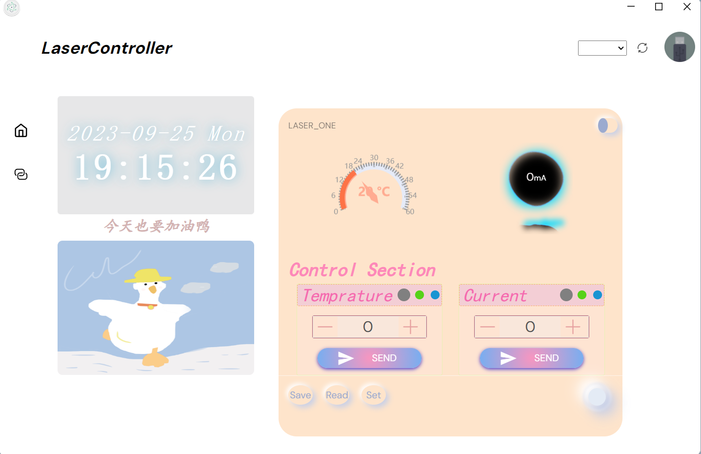
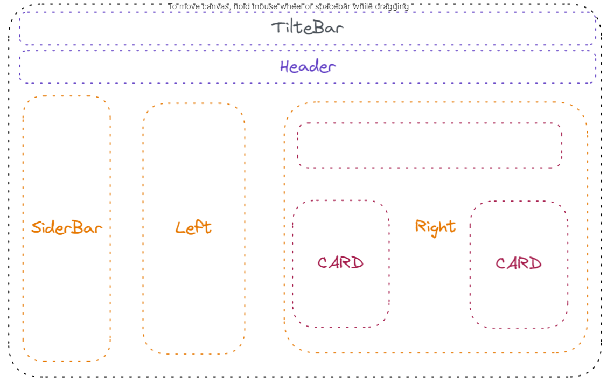

# electron-vite-vue

🥳 Really simple `Electron` + `Vue` + `Vite` boilerplate.

```
This desktop is designed in electron structure. The main display and process logic is based on Vite. The function of this desktop software is to show the current and temprature of the controller boards. In order to communicate with the micro controller unit, use Python based websocket and pyserial to achieve data transfer and processing.
```

# Result


显示部分的区域分块为如下框图所示：


🖥 TitleBar: 显示菜单栏，同时显示软件的LOGO和名称  
🖥 Header: 显示标题栏，现在瞎显示的，后面根据需要修改  
🖥 Sider: 边栏，现在也没用，可以用于切换不同的页面，利用SVG图标来实现跳转  
🖥 Left: Just for fun  
🖥 Right: 这部分为显示的核心，用于显示温度和电流的实时数值，同时提供控制输出框这部分也可以用于检测温度和电流的长期变化，方便检验长期波动
 

# Feature
📦 Out of the box  
🎯 Based on the official [template-vue-ts](https://github.com/vitejs/vite/tree/main/packages/create-vite/template-vue-ts), less invasive  
🌱 Extensible, really simple directory structure  
💪 Support using Node.js API in Electron-Renderer  
🔩 Support C/C++ native addons  
🖥 It's easy to implement multiple windows  

# Quick Start

```sh
npm run dev
```


# Directory

```diff
+ ├─┬ electron
+ │ ├─┬ main
+ │ │ └── index.ts    entry of Electron-Main
+ │ └─┬ preload
+ │   └── index.ts    entry of Preload-Scripts
  ├─┬ src
  │ ├── main.ts       entry of Electron-Renderer
  │ ├── assets
  │ ├── components
  │ ├── section
  │ ├── assets
  ├── index.html
  ├── package.json
  └── vite.config.ts
```


# Debug


# FAQ

- [C/C++ addons, Node.js modules - Pre-Bundling](https://github.com/electron-vite/vite-plugin-electron-renderer#dependency-pre-bundling)
- [dependencies vs devDependencies](https://github.com/electron-vite/vite-plugin-electron-renderer#dependencies-vs-devdependencies)
